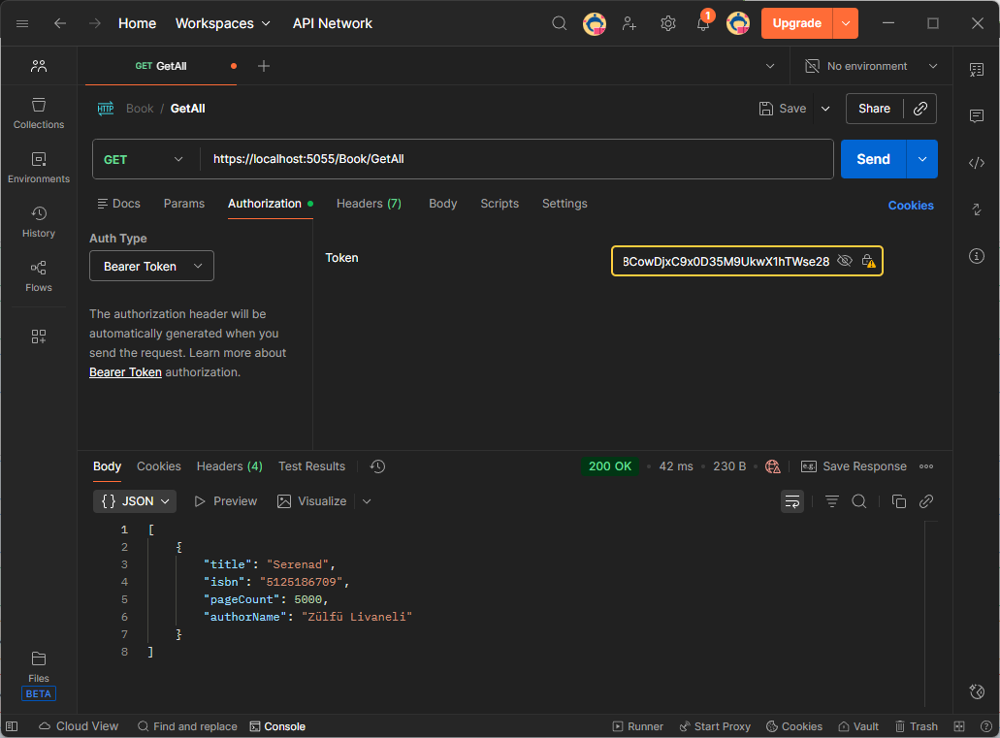
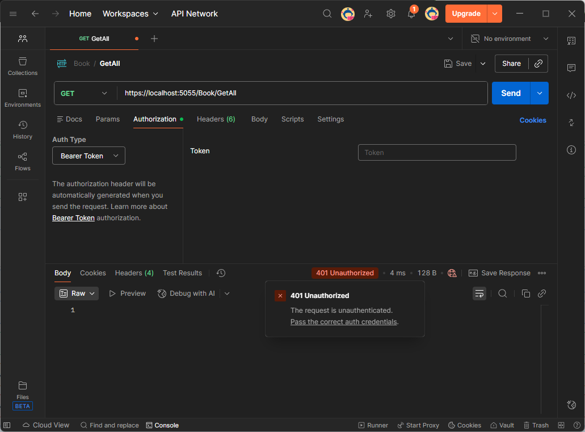
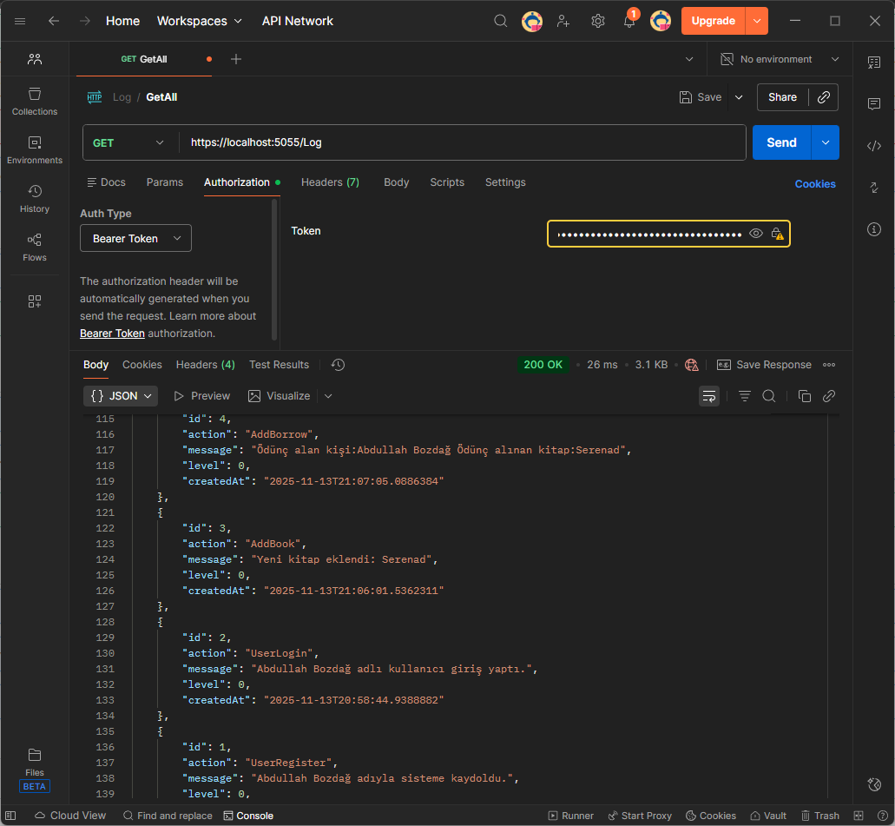
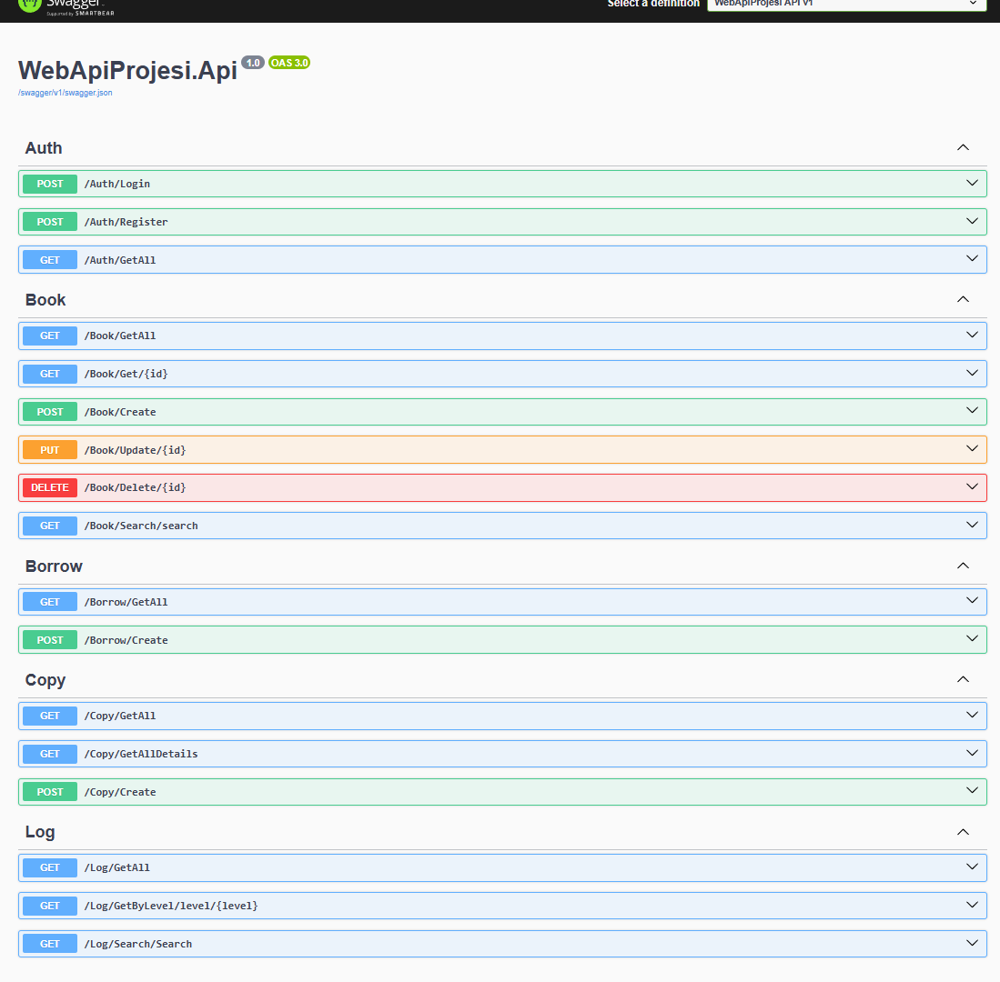

# 📚 Kütüphane Yönetimi Web API

Bu proje, bir kütüphane yönetim sisteminin temel işlevlerini sağlayan modern bir **RESTful Web API**'dir. Proje, ölçeklenebilirliği ve sürdürülebilirliği merkeze alan **Katmanlı Mimari** yaklaşımıyla **.NET 9.0** üzerinde geliştirilmiştir.

## ✨ Temel Özellikler

  * **Güvenli Yetkilendirme:** Kullanıcı girişi ve kayıt işlemleri.
  * **Kapsamlı Kitap Yönetimi:** Kitap oluşturma, okuma, güncelleme, silme (CRUD) ve arama işlemleri.
  * **Ödünç Takibi:** Kitapların ödünç alınma ve geri verme süreçlerinin yönetimi.
  * **Envanter Yönetimi:** Kitap kopyalarının detaylı takibi.
  * **Operasyonel İzleme:** Detaylı sistem loglarını seviye bazında sorgulama ve arama.
## Projeyle ilgili izlediğim yollar
* Sistemdeki kullanıcılar AppUser.cs sınıfı üzerinden barındırılırken, AppUser.cs sınıfı IdentityUser kütüphanesiyle kullanılmaktadır.
* Kütüphanedeki kitapların üzerindeki işlemleri BookCopy nesnesi üzerinden gerçekleştiriyoruz. Aksi taktirde, Book.cs üzerinden gerçekleştirdiğimiz senaryoda, kullanıcılarla ilişkisel bağlantı kurulamıyor. Her bir kitap, Book.cs nesnesi üzerinde barınırken, BookCopy nesnesi üzerinde kitapların fiziksel nüshaları tutulmaktadır.
* Kitapların fiziksel nüshaları sisteme kayıt edilirken (CopyService), istenilen kopya adeti parametre olarak verilip, döngü yardımıyla nüshalar oluşturuluyor.
* Proje hali hazırda geliştirme aşamasında olduğu için E-Posta bildirim servisini henüz geliştirmedim fakat her bir aksiyon, Kayıt Servisi aracılığıyla sistemde tutulmaktadır. Kullanıcı girişleri, kullanıcı kayıtları. Hangi kitabın eklendiği ve hangi kitabın, kimin tarafından ödünç alındığı kaydedilmektedir. Sistemde herhangi bir ekleme, güncelleme veya silme işlemi yapıldığı zaman, yapılan işlemin yanında Log Seviyesi de kaydedilmektedir. Kısacası, olası durumların (silme,güncelleme) Log Seviyesi sayesinde yakalanıp, Yetkili kişinin E-Posta adresine bildirim şeklinde gönderilecektir. 
## 🖼️ Projenin Görsel İçerikleri

### Auth/Login ile kullanıcı girişi, JwtToken üretilmesi

### Book/GetAll ile bütün kitapların sorgusu (JWT Auth)

### Book/GetAll ile bütün kitapların JWT'siz sorgusu (JWT Auth)

### Log/GetAll ile bütün raporların sorgusu (JWT Auth)


## Bütün endpointler


## 🛠️ Teknoloji Yığını ve Mimari

Bu proje, aşağıdaki modern teknolojileri ve tasarım desenlerini kullanmaktadır:

| Kategori | Teknoloji / Yaklaşım | Açıklama |
| :--- | :--- | :--- |
| **Çekirdek Platform** | **.NET 9.0** | Yüksek performanslı ve platformlar arası uygulama geliştirme çerçevesi. |
| **Veritabanı** | **MSSQL (Microsoft SQL Server)** | Güvenilir ve ölçeklenebilir ilişkisel veri depolama sistemi. |
| **Veri Erişim** | **Entity Framework (EF) Core** | Veri erişim katmanını sadeleştiren ve LINQ desteği sunan ORM. |
| **Mimari Desen** | **Katmanlı Mimari (Layered Architecture)** | Kodun ayrıştırılması, test edilebilirliği ve bakımı kolaylaştıran yapı. |
| **API Standartı** | **RESTful API** | HTTP metotlarını ve kaynak tabanlı URL'leri kullanan standart iletişim yapısı. |
| **Veri Formatı** | **DTO (Data Transfer Object)** | Katmanlar arası güvenli ve kontrollü veri transferi için kullanılan nesneler. |

## 🚀 Başlangıç

Bu API'yi yerel ortamınızda ayağa kaldırmak için aşağıdaki adımları takip edin.

### Önkoşullar

  * [.NET 9.0 SDK](https://dotnet.microsoft.com/download/dotnet/9.0)
  * Microsoft SQL Server veya SQL Server LocalDB

### Kurulum ve Çalıştırma

1.  **Projeyi Klonlayın:**
    ```bash
    git clone github.com/gryphonsft/KutuphaneWebAPI
    cd KutuphaneWebAPI
    ```
2.  **Veritabanını Yapılandırın:**
      * `appsettings.json` dosyasında yer alan `ConnectionStrings:DefaultConnection` değerini kendi MSSQL bağlantı dizginizle güncelleyin.
      * **Entity Framework Core Migrations** kullanarak veritabanını oluşturun:
        ```bash
        dotnet ef database update
        ```
3.  **Projeyi Çalıştırın:**
    ```bash
    dotnet run
    ```
    API, varsayılan olarak `https://localhost:[PORT]` (örneğin 5001) üzerinde çalışmaya başlayacaktır. Tarayıcınızda veya bir API istemcisinde `https://localhost:[PORT]/swagger` adresine giderek **Swagger UI** üzerinden endpoint'leri test edebilirsiniz.

## ⚙️ API Endpointleri

API, aşağıdaki ana kaynaklar (Resource) üzerinden hizmet vermektedir:

### 🔐 Auth (Yetkilendirme)

| Metot | Endpoint | Açıklama |
| :--- | :--- | :--- |
| `POST` | `/Auth/Login` | Kullanıcı girişi ve yetkilendirme (JWT token döndürür). |
| `POST` | `/Auth/Register` | Yeni kullanıcı kaydı oluşturma. |
| `GET` | `/Auth/Getall` | Kayıtlı tüm kullanıcıları listeler. *(Yetkilendirme gereklidir)* |

### 📘 Book (Kitap Yönetimi)

| Metot | Endpoint | Açıklama |
| :--- | :--- | :--- |
| `GET` | `/Book/Getall` | Tüm kitapların listesini getirir. |
| `GET` | `/Book/Get/{id}` | Belirtilen ID'ye sahip kitabın detaylarını getirir. |
| `POST` | `/Book/Create` | Verilen bilgilerle yeni bir kitap kaydı oluşturur. |
| `PUT` | `/Book/Update/{id}` | Belirtilen kitabı günceller. |
| `DELETE` | `/Book/Delete/{id}` | Belirtilen kitabı sistemden siler. |
| `GET` | `/Book/search` | Kitaplar arasında arama kriterlerine göre sorgulama yapar. |

### 🤝 Borrow (Ödünç İşlemleri)

| Metot | Endpoint | Açıklama |
| :--- | :--- | :--- |
| `GET` | `/Borrow/Getall` | Tüm ödünç alma/verme işlemlerini listeler. |
| `POST` | `/Borrow/Create` | Yeni bir kitap ödünç alma işlemi kaydeder. |

### 📖 Copy (Kitap Kopya Yönetimi)

| Metot | Endpoint | Açıklama |
| :--- | :--- | :--- |
| `GET` | `/Copy/Getall` | Kitap kopyalarının temel listesini getirir. |
| `GET` | `/Copy/GetallDetails`| Kitap kopyalarını bağlı oldukları kitap detaylarıyla listeler. |
| `POST` | `/Copy/Create` | Kitaba ait yeni bir kopya kaydı oluşturur. |

### 🗒️ Log (Sistem Kayıtları)

| Metot | Endpoint | Açıklama |
| :--- | :--- | :--- |
| `GET` | `/Log` | Tüm sistem loglarını listeler. |
| `GET` | `/Log/level/{level}` | Belirtilen log seviyesine göre (örneğin, `Error`) filtreleme yapar. |
| `GET` | `/Log/Search` | Log kayıtları içinde serbest arama yapar. |

-----
